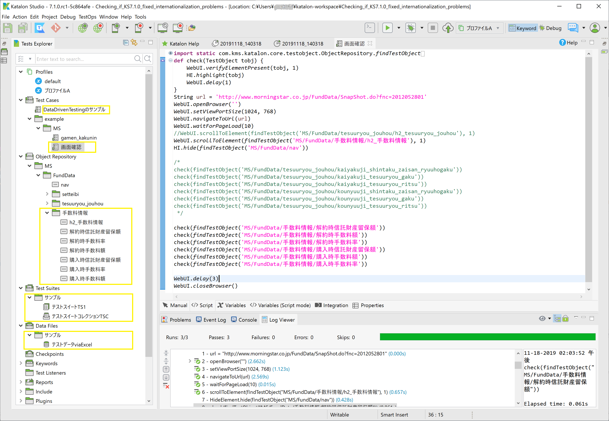
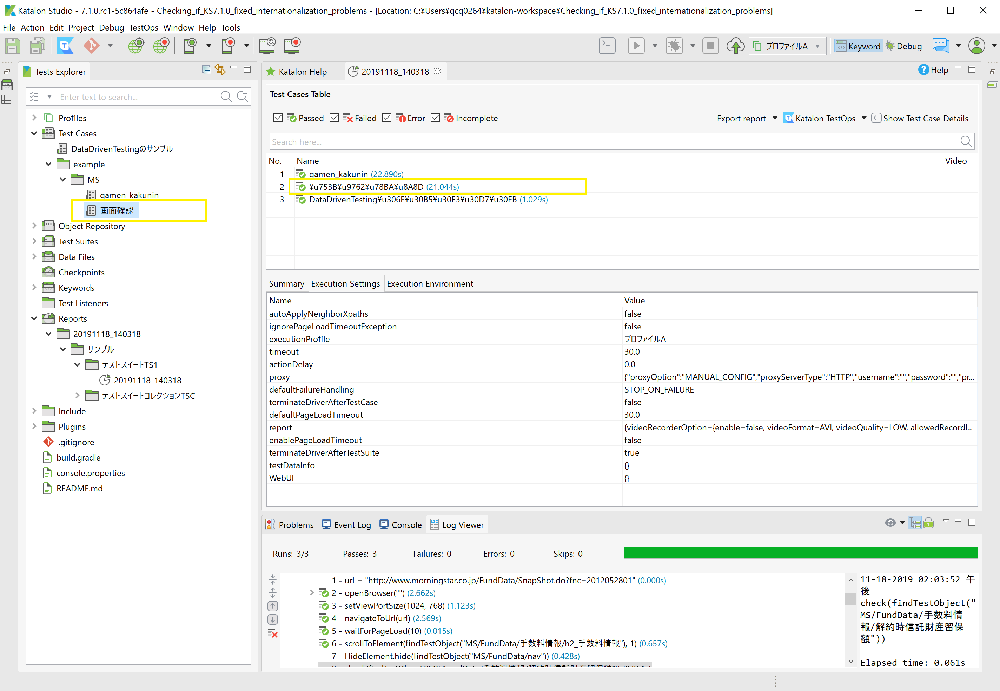

Checking if Katalon Studio 7.1.0 fixed internationalization problems
==============

## Background

I once posted a discussion to the Katalon Forum regarding an internationalization problem of Katalon Studio.
The URL of the discussion is
- https://github.com/kazurayam/IWantToNameTestObjectsInMyLanguage

As devalex88 commented at https://forum.katalon.com/t/i-want-to-name-testobjects-in-my-native-language/33889/4
Katalon Studio [v7.1.0rc1](https://github.com/katalon-studio/katalon-studio/releases/tag/v7.1.0.rc1) has been published.

## Changes at v7.1.0rc1

I made a project to check the v7.1.0 rc1 to see if the internationalization problem has beem fixed. The project is shared
on GitHub at

- https://github.com/kazurayam/Checking_if_KS7.1.0_fixed_internationalization_problems

I found that v7.1.0 rc1 has been much improved. Let me note a list of changes at v7.1.0 rc1 I found:

1. The Katalon Project can have name containing non-latin characters. For example `サンプルproject`.
2. Test Cases directory can contain folders and test cases named with non-latin characters. For example `Test Cases/DataDrivenTestingのサンプル` and `Test Cases/example/MS/画面確認`.
3. Object Repository directory can contain folders and test objects named with non-latin characters. For example `Object Repository/MS/FundData/手数料情報/解約時信託財産留保額`.
4. Test Suites directory can contain folders, test suites and test suite collections named with non-latin characters. For example `Test Suites/サンプル/テストスイートTS1`.
5. Data Files directory can contain folders and data file named with non-latin characters. For example `Data Files/サンプル/テストデータviaExcel`.

These changes are fine. Here I attached a screenshot which shows how the Tests Exploure looks like. The folders and objects named in 日本語 look much more instuitive and easier  for me.

## Stuff to be improved

I found a few problems in the [Basic Report plugin](https://store.katalon.com/product/59/Basic-Report) with respect to the internationalized names of Test cases etc.

1. The Basic Report result shows the name of a test case `画面確認` in UNICODE escape sequence as `\u753B\u9762\u78BA\u8A8D`. I want the name to be shown in raw Japanese, not escaped.

2. The PDF exported by the Basic Report pluging seems to be unable to show any non-latin characters. See the attached [PDF example](docs/pdf/20191118_140318.pdf). I have a test object named `MS/FundData/h2_手数料情報`, but it is printed in the PDF as `MS/FundData/h2_`. I think that that PDF is not enabled to print Japanese characters because appropriate Font is not configured.
